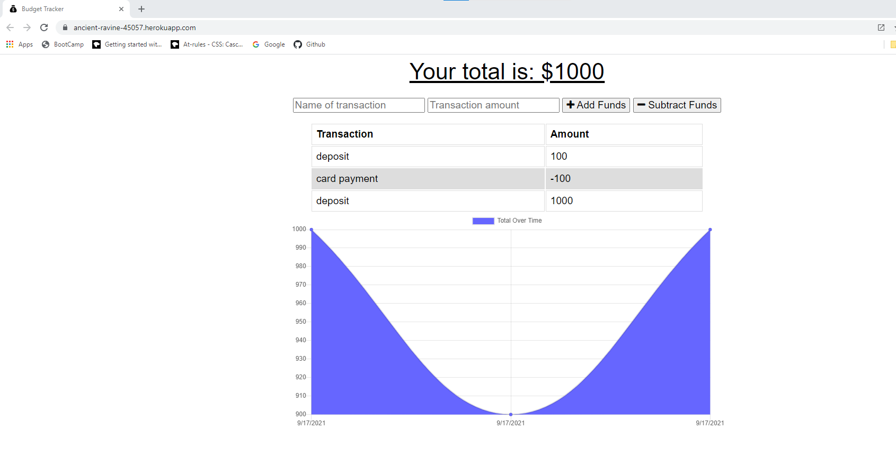
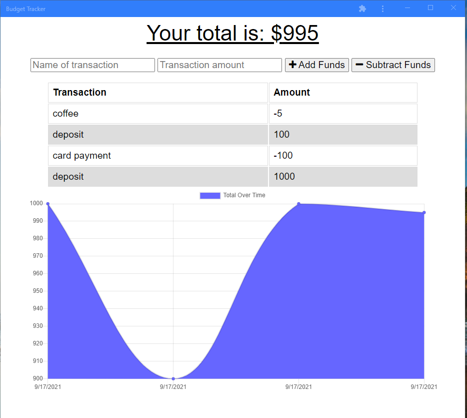

# PWA Budget Tracker

## Description

Challenge was to update an existing budget tracker application to allow for offline access and functionality. The user will be able to add expenses/deposits to their budget with or without a connection. The total will be updated once the connection is restored.

## Table of Contents

- [Installation](#installation)
- [Usage](#usage)
- [License](#license)
- [Screenshots](#screenshots)
- [Website](#website)
- [Questions](#questions)

## Installation

- Fork the program to your computer
- Install dependencies
  - npm i express
  - npm i compression
  - npm i mongoose
  - npm i morgan

## Usage

Application to keep track of budget, you can access the application via website or by installing the application for offline access.

## License

This application is covered by MIT License. For more information about the license please click [here](https://choosealicense.com/licenses/mit/)

## Screenshots

Website:

Application:

## Website

Click [here](https://ancient-ravine-45057.herokuapp.com/) to access the application

## Questions

For any questions, please contact me using the information below:

- Github Profile: [RiveraDenisse](https://github.com/RiveraDenisse)
- Email me at : denisse_alejandrar@hotmail.com
